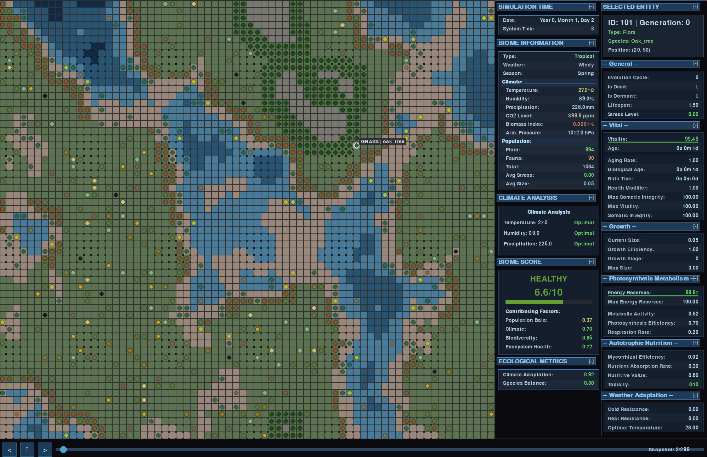
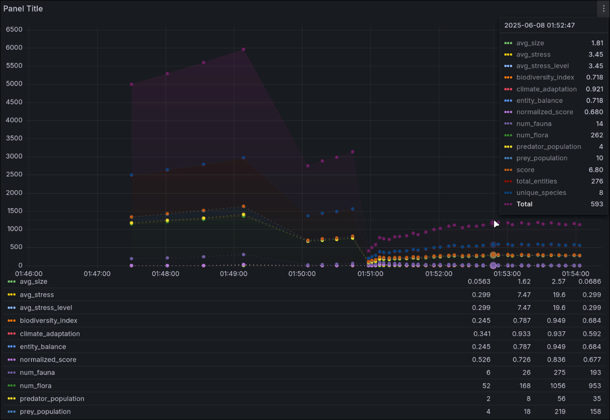
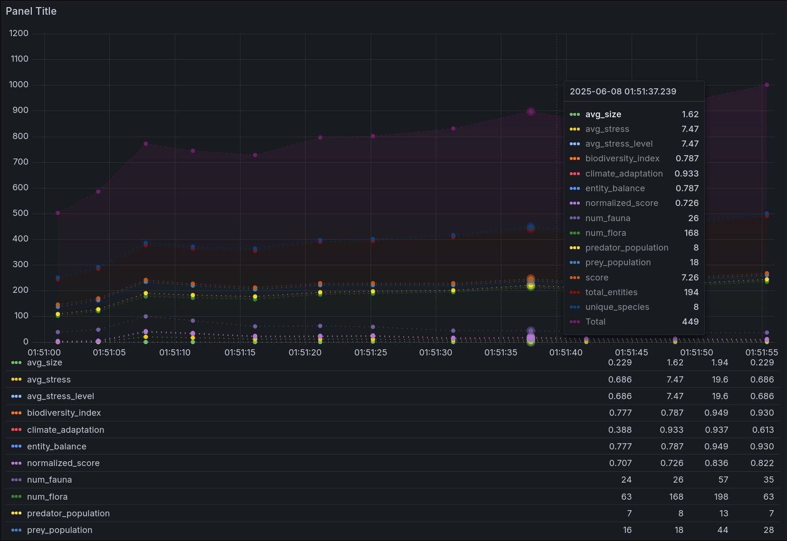

<p align="center">
  
</p>


<p align="center" style="margin-top:1rem;">
  <a href="#english-version" style="
      font-size:1.25rem;
      font-weight:700;
      text-decoration:none;
      padding:4px 12px;
      border:2px solid currentColor;
      border-radius:4px;
    ">
    ENGLISH VERSION HERE
  </a>
</p>
<div style="text-align: center;">
  <h3 style="font-size: 3rem;">
    ¿Qué es Echoes of GaIA?
  </h3>
  <hr style="width: 50%; margin: 8px auto;" />
</div>


[Echoes of GaIA](https://www.echoes-of-gaia.com) es un framework híbrido que hace de simulador de
biomas artificiales; modela la evolución y dinámica de
entornos naturales y lo integra con un sistema multiagente. Por defecto, existen biomas como el tropical, desierto,
taiga, sabana y tundra, pero esto se puede extender fácilmente. Las especies de flora y fauna evolucionan sus genes
gracias a variaciones de algoritmos genéticos que perciben las presiones ambientales y climáticas.

El núcleo son los agentes - por defecto existe: un agente climático, uno de fauna (ambos utilizan Reinforcement
Learning - clima para control climático general y eventos meteorológicos | fauna para dinamicas de presa-depredador y
comportamientos de forrajeo), agentes evolutivos para cada especie, y un agente neurosimbólico de equilibrio que combina
redes neuronales con sistemas expertos ó grafos como bases de conocimiento para mantener el balance del ecosistema. Para
intentar modelar mejor la naturaleza, se han implementado vertientes computacionales de procesos y fenómenos tanto
biológicos como ecológicos - eficiencia fotosintética, modelos de crecimiento, nutriciones auto/heterótrofas, cadenas
tróficas...etc.

El framework ha sido implementado para que disponga de una arquitectura modular (sistemas de entidades-componentes (
ECS)) - gracias a ello, se puede extender por otr@s desarrolladoras/es fácilmente y se puede experimentar con diferentes
configuraciones de biomas, incluir nuevos componentes, especies... e incluso implementar nuevos agentes. En general, la
idea es que se pueda jugar con ello e incluir lo que se desee, para que gracias al simulador se puedan hacer estudios
sobre dinámicas ecológicas complejas y servir como base para proyectos de simulación ambiental más especializados.

## Erratas en memoria técnica

He detectado un par de erratas en la memoria técnica tras la entrega en ADDI. Por un lado, en el tema de modelado
computacional de biomas - componente vital - función hormética por tramos; tanto los coeficientes en la función como la
gráfica no correspondía, hice muchas pruebas y al parecer mezclé resultados. Ahora está corregido:

- [https://github.com/geru-scotland/echoes-of-gaia/commit/4045dc3aa98b7f7e0053f923f42207f34e27a429](https://github.com/geru-scotland/echoes-of-gaia/commit/4045dc3aa98b7f7e0053f923f42207f34e27a429)
- [https://github.com/geru-scotland/echoes-of-gaia/commit/e4cc66a04cb4135199dd5f295a022e4c608d52a2](https://github.com/geru-scotland/echoes-of-gaia/commit/e4cc66a04cb4135199dd5f295a022e4c608d52a2)
-

Gráfica: [https://echoes-of-gaia.com/images/figures/hormesis_corregida.png](https://echoes-of-gaia.com/images/figures/hormesis_corregida.png)

- Cambios en
  memoria: [https://echoes-of-gaia.com/docs/TFG_Aingeru_memoria_Echoes_of_GaIA.pdf#subsubsection.2.4.1.3](https://echoes-of-gaia.com/docs/TFG_Aingeru_memoria_Echoes_of_GaIA.pdf#subsubsection.2.4.1.3)

También, en el componente de nutrición autotrofa, en el cálculo de la tasa efectiva de hambre - estaba por error como
factor en el cálculo de la ganancia energética, cuando esa tasa efectiva es un factor de decay. Ahora está corregido y
hace que se requiera de una mejor eficiencia metabólica (la cual se deteriora con el estrés acumulado). Ver cambios
actualizados en memoria téncnica:

- [https://echoes-of-gaia.com/docs/TFG_Aingeru_memoria_Echoes_of_GaIA.pdf#subsubsection.2.4.4.1](https://echoes-of-gaia.com/docs/TFG_Aingeru_memoria_Echoes_of_GaIA.pdf#subsubsection.2.4.4.1)

## Overview con DeepWiki

DeepWiki es una herramienta que he descubierto hace poco; muy buena para hacer análisis arquitectural y del flujo de los
sistemas de proyectos. [Análisis de Echoes of Gaia](https://deepwiki.com/geru-scotland/echoes-of-gaia/).

## Índice

1. [Links](#links)
2. [Scripts principales](#scripts-principales)
3. [Ecosystem.js](#ecosystemjs)
4. [Nuevos agentes](#nuevos-agentes)
5. [Nuevos componentes](#nuevos-componentes)
6. [Nuevos tipos de biomas, especies y escenarios](#nuevos-tipos-de-biomas-especies-y-escenarios)
7. [Más configuraciones](#más-configuraciones)
8. [Soporte para InfluxDB](#soporte-para-influxdb-y-grafana)
9. [Pull requests](#pull-requests)
10. [Instalación](#instalación)

## Links

- [**Web del proyecto**](https://geru-scotland.github.io/echoes-of-gaia-web/)

- [**Poster**](https://geru-scotland.github.io/echoes-of-gaia-web/images/poster.png)

  Para información más en detalle acerca de los intringulis del proyecto, se pueden consultar los siguientes
  documentos. A parte de los detalles técnicos, se contextualiza sobre el ambiente/entorno y motivaciones de Echoes of
  GaIA.

- [**Memoria técnica**](https://geru-scotland.github.io/echoes-of-gaia-web/docs/TFG_Aingeru_memoria_Echoes_of_GaIA.pdf)

- [**Fundamentos, arquitectura y sistemas**](https://geru-scotland.github.io/echoes-of-gaia-web/docs/TFG_Aingeru_anexo_fundamentos_arquitectura_sistemas.pdf)

## Scripts principales

| **Ruta**                                 | **Propósito**                                                                                                                                                                                                        |
|------------------------------------------|----------------------------------------------------------------------------------------------------------------------------------------------------------------------------------------------------------------------|
| `experiments/main.py`                    | Lanza experimentos configurables para poder hacer diferentes estudios.                                                                                                                                               |
| `simulation/dataset/generate_dataset.py` | Si quieres generar datasets sintéticos, con este script se pueden generar datos para entrenar modelos de IA.                                                                                                         |
| `training/deep_learning/main.py`         | Desde aquí se pueden entrenar modelos de deep learning con datos de simulación (LSTM multivariante y multihorizonte con atención / Transformers por defecto). Permite experimentar con arquitecturas custom también. |
| `research/training/main.py`              | Pipeline de entrenamiento para agentes RL.                                                                                                                                                                           |
| `simulation/main.py`                     | Motor principal - crea mundos con biomas configurables con todos los agentes activos. Básicamente es el corazón del framework.                                                                                       |
| `simulation/visualization/main.py`       | Visor de snapshots y datapoints, es simplemente una forma básica para poder interpretar las simulaciones. Imagen debajo de ésta tabla.                                                                               |
| `research/cli.py`                        | CLI para gestionar entrenamientos, experimentos y análisis. Funcional, excepto lanzamiento de trainings.                                                                                                             |## Cómo extender

Ejemplo del visor ([ver imagen original](https://geru-scotland.github.io/echoes-of-gaia-web/images/figures/biome3.png)):

<p align="center">
  
</p>

### Ecosystem.js

En
`biome/data/ecosystem.json` ([link](https://github.com/geru-scotland/echoes-of-gaia/blob/development/biome/data/ecosystem.json))
es donde encontrarás todas las definiciones base, desde biomas, hábitats, factores
ambientales por bioma-estación, especies, componentes disponibles...etc
Tengo pendiente pasarlo a DB. Si te animas a implementarlo antes de que lo haga yo, pues te agradeceré un PR.

Es muy intuitivo, pero a modo de preview:

```json
{
  "biomes": {
    "temperate_forest": {
      "weights": [
        5,
        8,
        10,
        15,
        45,
        12,
        5,
        0
      ],
      "environmental_factors": {
        "temperature": {
          "min": 15,
          "max": 25
        },
        "humidity": {
          "min": 40,
          "max": 70
        },
        "biomass_density": 60
      },
      "seasonal_info": {
        "spring": {
          "deltas": {
            "temperature": 2,
            "humidity": 10
          },
          "comfort_range": {
            "temperature": {
              "min": 18,
              "max": 24
            }
          }
        }
      }
    }
  }
}
```

Los `weights` controlan la generación procedural del terreno:
`[WATER_DEEP, WATER_MID, WATER_SHALLOW, SHORE, GRASS, MOUNTAIN, SNOW, SAND]`. Con -1 desactivas un tipo de terreno
completamente. Esto está explicado en la memoria, **tema 2, Modelos computacional de los Biomas**, apartado de
**Generación procedural de mapas: algoritmo Perlin noise**

### Nuevos agentes

Para añadir un agente custom al sistema, es tan simple como hacer lo siguiente:

#### 1. Implementar Agent base

En `biome/agents`, crea tu nuevo agente:

```python
from biome.agents.base import Agent
from shared.types import Observation
from typing import Dict, Any

from biome.systems.climate.state import ClimateState
from biome.systems.climate.system import ClimateSystem


class MiAgenteCustom(Agent[Observation, Dict[str, Any]]):
    def __init__(self, mi_parametro: str = "default"):
        self._mi_parametro = mi_parametro
        self._climate: ClimateSystem = ClimateSystem()

    def perceive(self) -> Observation:
        # Aquí accedes a EntityProvider, ClimateSystem, etc; lo que necesites para
        state: ClimateState = self._climate.get_state_and_record()
        # tomar la decisión
        return {
            "mi_parametro": self._mi_parametro,
            "climate_state": state
        }

    def decide(self, observation: Observation) -> Dict[str, Any]:
        # Aquí ya, simplemente procesas en función de lo que necesites y haces la predicción
        # con tu sistema de IA. Ejemplo simple, meramente ilustrativvo:
        if observation["datos_clima"]["temperature"] > 30.0:
            return {"accion": "reducir_actividad", "factor": 0.5}
        return {"accion": "mantener", "factor": 1.0}

    def act(self, action: Dict[str, Any]) -> None:
        # Se actúa, se modifica el entorno.  
        if action["accion"] == "reducir_actividad":
            self._aplicar_intervencion(action["factor"])
```

#### 2. Añade al enum AgentType

En `shared/enums/enums.py`:

```python
class AgentType(EnumBaseStr):
    CLIMATE_AGENT = "climate_agent"
    EVOLUTION_AGENT = "evolution_agent"
    FAUNA_AGENT = "fauna_agent"
    EQUILIBRIUM_AGENT = "equilibrium"
    MI_AGENTE_CUSTOM = "mi_agente_custom"  # Añadir aquí
```

#### 3. Falta integrarlo en _initialize_agents

En `biome/biome.py`, dentro del método `_initialize_agents`:

```python
def _initialize_agents(self, mode: SimulationMode) -> Dict[AgentType, Agent]:
    agents: Dict[AgentType, Agent] = {}

    # ... otros agentes 

    # Tu agente custom
    mi_agente: MiAgenteCustom = MiAgenteCustom(mi_parametro="custom_value")
    agents.update({AgentType.MI_AGENTE_CUSTOM: mi_agente})
    self._env.process(self._run_agent(AgentType.MI_AGENTE_CUSTOM, Timers.Agents.Custom.UPDATE_INTERVAL))

    return agents
```

#### 4. También define un timer personalizado

En `shared/timers.py`:

```python
class Timers:
    class Agents:
        # ... otros timers
        class Custom(EnumBaseInt):
            UPDATE_INTERVAL = 5  # Cada 5 ticks del simualdor
```

El método `_run_agent` ya existe en biome.py y es el que se encarga automáticamente del ciclo `perceive → decide → act`
en un loop
infinito. No necesitas modificarlo - simplemente registra tu agente y el se encarga de todo. Ahora bien, la lógica de la
IA la tienes que implementar tú, claro.

### Nuevos componentes

Vamos a ver ahora como se puede ampliar Echoes of GaIA con nuevos componentes. Para más contexto, puedes ver los
[componentes base](https://github.com/geru-scotland/echoes-of-gaia/tree/development/biome/components)
y [sus managers]( https://github.com/geru-scotland/echoes-of-gaia/tree/development/biome/systems/components/managers).

#### 1. Empieza creando el componente custom

En `/biome/components/` (puedes crear una nueva carpeta que se llame custom, una nueva categoría o colocarlo en una de
las existentes):

```python
from biome.components.base.component import EntityComponent
from biome.systems.components.registry import ComponentRegistry
from shared.enums.enums import ComponentType
from shared.enums.events import ComponentEvent
from typing import Dict, Any


class MiComponenteCustom(EntityComponent):
    def __init__(self, env, event_notifier, lifespan: float = 10.0, mi_parametro=1.0):
        super().__init__(env, ComponentType.CUSTOM, event_notifier, lifespan)

        self._mi_parametro = mi_parametro
        self._estado_interno = 0.0
        self._energia_custom = 100.0

        # Primero registramos el componente en su manager. 
        ComponentRegistry.get_custom_manager().register_component(id(self), self)

    def _register_events(self):
        super()._register_events()
        # Ahora puedes escuchar eventos del sistema para que tu componente sea notificado cuando algo ocurra
        # También podrías escuchar eventos de la simulación o incluso del bioma, a tu gusto. En el documento de 
        # Fundamentos, Arquitectura y sistemas principales cuento lo de los 3 niveles de buses. Éste, es local a la entidad:
        self._event_notifier.register(ComponentEvent.WEATHER_UPDATE, self._handle_weather_update)
        self._event_notifier.register(ComponentEvent.STRESS_CHANGE, self._handle_stress_change)

    def _handle_weather_update(self, temperature, humidity, **kwargs):
        # A modo de ejemplo rápido y simplista, para poder reaccionar a cambios climáticos
        if temperature > 30.0:
            self._apply_heat_stress(
                5.0)  # En el framework tiendo a no utilizar constantes así, verás diferentes enums ya preparados

    def _handle_stress_change(self, stress_delta, **kwargs):
        if stress_delta > 10.0:
            self._trigger_adaptive_response()

    def _apply_heat_stress(self, stress_amount: float):
        # A parte de escuchar, tu componente puede notificar al resto de un cambio. 
        self._event_notifier.notify(
            ComponentEvent.STRESS_CHANGE,
            component=self.__class__,
            stress_delta=stress_amount,
            source="heat_stress"
        )

    def _trigger_adaptive_response(self):
        # Más de lo mismo...pero ahora con atributos intrínsecos a tu componente (_estado_interno) 
        self._estado_interno *= 0.8
        self._event_notifier.notify(
            ComponentEvent.UPDATE_STATE,
            MiComponenteCustom,
            estado_interno=self._estado_interno,
            adaptive_response=True
        )

    def get_state(self) -> Dict[str, Any]:
        # Importante sobreescribir este método. Ésta información va a ser agregada y sirve para muchas cosas, desde 
        # snapshots, datapoints, cálculo de estadísticas...etc. Que no se te olvide! Eso si, pon la información que quieras, sólo
        # la que consideres necesaria.
        return {
            "mi_parametro": self._mi_parametro,
            "estado_interno": self._estado_interno,
            "energia_custom": self._energia_custom,
            "is_active": self._host_alive
        }

    def disable_notifier(self):
        super().disable_notifier()
        ComponentRegistry.get_custom_manager().unregister_component(id(self))

    @property
    def is_active(self) -> bool:
        return self._host_alive

    @property
    def is_dormant(self) -> bool:
        return self._is_dormant

    # Puedes implementar todas las @property que quieras, a mi me gusta tener disponibles los atributos principales del componente.
    # Principalmente serán útiles en el manager, que lo vemos ahora.
```

---

#### 2. Ahora, crea el manager

Un manager, se encarga de gestionar, recolectar y actualizar a todos sus componentes - con sus componentes, me refiero a
todos aquellos que sean del mismo tipo y estén distribuido entre muchas entidades. [Aquí una imagen que creo ayudará a
verlo más claro](https://geru-scotland.github.io/echoes-of-gaia-web/images/figures/descen-vs-cent.png) (derecha, versión
**centralizada**). Con esto, podemos paralelizar / vectorizar los cálculos matemáticos de los componentes de todas las
entidades simultaneamente.

En `/biome/systems/components/managers/` crea tu manager:

```python
from biome.systems.components.managers.base import BaseComponentManager
from typing import List
import numpy as np
from simpy import Environment as simpyEnv


class CustomComponentManager(BaseComponentManager[MiComponenteCustom]):
    def __init__(self, env: simpyEnv):
        super().__init__(env)
        self._logger = LoggerManager.get_logger(Loggers.BIOME)

        # Pon todos los procesos que necesites, aquí muestro uno sólo, que se encarga de ir reduciendo
        # el parámetro custom en un 1% con un timer establecido en el enum de Timers.
        self._env.process(
            self._update_all_parametro_drift(Timers.Components.Custom.PARAMETRO_DRIFT)
        )

    def _update_all_parametro_drift(self, timer: int):
        yield self._env.timeout(timer)

        while True:
            active_components = self._get_active_components()

            if active_components:
                # Con esto, ahora tienes un todos los parámetros custom en array numpy
                # List comprehension no es solo por introducir código compacto, ojo. Están 
                # optimizadas en C (en contraste a meros loops) y con ello tenemos algo más de eficiencia.
                parametros = np.array([comp._mi_parametro for comp in active_components])

                # He aquí el motivo de esta arquitectura, ahora puedes calcular lo que tengas que calcular, de forma vectorizada
                # para los atributos de éste componente de TODAS las entidades. Este cálculo es relativamente trivial, pero hay otros componentes
                # que pueden utilizar cálculos más costosos, aquí por ejemplo gaussianas:
                # https://github.com/geru-scotland/echoes-of-gaia/blob/development/biome/systems/components/managers/weather_adaptation_manager.py
                drift_rates = parametros * 0.01
                nuevos_parametros = np.maximum(0.0, parametros - drift_rates)

                # Ahora, actualizamos los componetnes con los nuevos valores.
                for i, component in enumerate(active_components):
                    if component._mi_parametro != nuevos_parametros[i]:
                        component._mi_parametro = nuevos_parametros[i]
                        component._event_notifier.notify(
                            ComponentEvent.UPDATE_STATE,
                            MiComponenteCustom,
                            mi_parametro=component._mi_parametro
                        )

            yield self._env.timeout(timer)
```

---

#### 3. Registara tu manager en `ComponentRegistry`

En `biome/systems/components/registry.py` agrega esto:

```python
class ComponentRegistry:
    _custom_manager = None

    @classmethod
    def initialize(cls, env: simpyEnv, cleanup_dead_entities: bool = True):
        # ... otros managers 
        cls._custom_manager = CustomComponentManager(env)

    @classmethod
    def get_custom_manager(cls):
        if cls._custom_manager is None:
            raise RuntimeError("CustomComponentManager hasn't been initialized")
        return cls._custom_manager
```

---

#### 4. Define tu nuevo componente en `ecosystem.json`

En `biome/data/ecosystem.json`, agrégalo en componentes y establece los parámetros por defecto que quieras:

```json
{
  "components": {
    "MiComponenteCustom": {
      "defaults": {
        "mi_parametro": 1.0
      }
    }
  }
}
```

---

#### 5. Opcional pero recomendable el registrar el tipo de componente

En `shared/enums/enums.py`:

```python
class ComponentType(Enum):
    # ... componentes 
    CUSTOM = "custom"
```

### Nuevos tipos de biomas, especies y escenarios.

Si quieres crear flora custom, fauna custom, o **tipos** biomas custom es muy directo - defines sus características en
`ecosystem.js` y
referencias en archivos `YAML`. Es decir, por un lado tenemos el **tipo de Bioma** (tundra, tropical, taiga...etc) y por
otro **la instancia de Bioma**, esto es, el **escenario que hemos creado para la simulación actual**. Este escenario se
puede configurar de manera muy sencilla.

Para ilustrar todo esto, vamos a crear un **nuevo tipo de bioma** y vamos a crear **un escenario (instancia de bioma)**
que haga uso de él. También, **especies custom de flora y fauna**.

**NOTA IMPORTANTE:** Si creas nuevos **tipos de biomas**, deberías de reentrenar los agentes de clima y fauna. Si no
entrenas y tu bioma custom se parece a otros, es posible que dada la generalización de los agentes funcione
razonablemente bien, pero, yo te aconsejo reentrenar. Lo mismo ocurre con nuevos tipos de dietas. Si sólo creas otras
cosas, como nuevas especies etc, no es necesario.

#### Biomas como escenarios

Para configurar un escenario custom, sigue estos pasos:

#### 1. Créalo en `ecosystem.json`

Primero añades tu bioma en `biome/data/ecosystem.json`. Básate en otros biomas para crear el tuyo, ponle pesos en
función de los terrenos que desees, factores ambientales...etc:

```json
{
  "biomes": {
    "mi_bioma_custom": {
      "weights": [
        5,
        8,
        10,
        15,
        45,
        12,
        5,
        0
      ],
      "environmental_factors": {
        "temperature": {
          "min": 15,
          "max": 25
        },
        "humidity": {
          "min": 40,
          "max": 70
        },
        "precipitation": {
          "min": 50,
          "max": 150
        },
        "biomass_density": 60,
        "fauna_density": 45,
        "co2_level": 410,
        "atm_pressure": 1010
      },
      "seasonal_info": {
        "spring": {
          "deltas": {
            "temperature": 2,
            "humidity": 10,
            "precipitation": 100,
            "atm_pressure": -1
          },
          "comfort_range": {
            "temperature": {
              "min": 18,
              "max": 24
            },
            "humidity": {
              "min": 45,
              "max": 75
            },
            "precipitation": {
              "min": 80,
              "max": 200
            }
          }
        }
        // ... resto de estaciones
        // y otros parámetros 
      }
    }
  }
}
```

#### 2. Ahora, su propio archivo de configuración YAML

Después creas `config/biomes/mi_bioma_custom.yaml`, pongo valores aleatorios a modo de placeholders:

```yaml
biome:
  type: "mi_bioma_custom"

  flora:
    - species: "mi_planta_custom"
      spawns: 25
      avg-lifespan: 6
      components:
        - GrowthComponent:
            max_size: 2.5
            growth_efficiency: 0.9
        - VitalComponent:
            max_vitality: 120.0
            aging_rate: 0.8
        - WeatherAdaptationComponent:
            optimal_temperature: 20.0
            cold_resistance: 0.6
            heat_resistance: 0.4
        - AutotrophicNutritionComponent:
            nutrient_absorption_rate: 0.35

  fauna:
    - species: "mi_animal_custom"
      spawns: 15
      diet: "omnivore"
      avg-lifespan: 4
      components:
        - GrowthComponent:
            max_size: 1.8
        - VitalComponent:
            max_vitality: 100.0
        - WeatherAdaptationComponent:
            optimal_temperature: 22.0
        - MovementComponent:
            movement_energy_cost: 0.75
        - HeterotrophicNutritionComponent:
            hunger_rate: 0.9
            metabolism_efficiency: 1.1
```

Ese fichero, generalmente se llamará automaticamente durante entrenamientos (depende del agente), junto con otros
biomas.

Para lanzar simulaciones y que utilice tu nuevo bioma custom, hay que ponerlo en otro fichero:

#### 3. Referencialo en configuración principal

Por último, en `config/biome.yaml` e incluso en `config/training.yaml` (tiene apartado de biome) especificas tu nuevo
bioma:

```yaml
biome:
  type: "mi_bioma_custom"
  # ... resto de configuración
```

#### Ahora flora y fauna custom

Para especies custom, también tienes que definirlas en `ecosystem.json`:

```json
{
  "flora": {
    "mi_planta_custom": {
      "habitat": [
        "grassland",
        "shore"
      ],
      "components": {
        "WeatherAdaptationComponent": {
          "optimal_temperature": 20.0,
          "cold_resistance": 0.6,
          "heat_resistance": 0.4
        },
        "GrowthComponent": {
          "growth_modifier": 1.2,
          "max_size": 2.5
        },
        "AutotrophicNutritionComponent": {
          "nutrient_absorption_rate": 0.35,
          "base_nutritive_value": 0.7
        }
      }
    }
  },
  "fauna": {
    "mi_animal_custom": {
      "diet": "omnivore",
      "habitat": [
        "grassland"
      ],
      "components": {
        "WeatherAdaptationComponent": {
          "optimal_temperature": 22.0,
          "heat_resistance": 0.5,
          "cold_resistance": 0.3
        },
        "MovementComponent": {
          "movement_energy_cost": 0.75
        },
        "HeterotrophicNutritionComponent": {
          "hunger_rate": 0.9,
          "thirst_rate": 1.2,
          "metabolism_efficiency": 1.1
        }
      }
    }
  }
}
```

Puedes basarte en otras especies ya hechas para definir ciertas cosas, crear nuevos hábitats...etc.

### Funcionalidades del sistema de componentes

Aún está pendiente documentar un API para mostrar funcionalidades de componentes, pero puedes fijarte en el resto de
componentes y en las clases de las que derivan. No obstante, siéntente libre de implementar nuevas funcionalidades,
handlers...etc

### Más configuraciones

| **Archivo**              | **Descripción**                                                                                      |
|--------------------------|------------------------------------------------------------------------------------------------------|
| `config/biome.yaml`      | Configuración principal del bioma - especies iniciales, componentes y parámetros sobreescritos...etc |
| `config/simulation.yaml` | Parámetros de simulación - duración, intervalos de muestreo y métricas a recoger, plots...           |
| `config/training.yaml`   | Ajustes para RL - algoritmos, hiperparámetros y arquitecturas de red.                                |
| `config/neural.yaml`     | Parámetros del sistema neurosimbólico.                                                               |
| `config/fauna.yaml`      | Configuración de agentes de RL de fauna                                                              |
| `config/climate.yaml`    | y de clima.                                                                                          |

### Soporte para InfluxDB y Grafana

Para desarrollo local, puedes levantar un[ contenedor docker de InfluxDB](https://hub.docker.com/_/influxdb) o
[instalarlo directamente](https://docs.influxdata.com/influxdb3/core/). Crea un bucket para mediciones y las
credenciales, las puedes configurar en un `.env`:

```env
INFLUXDB_URL=http://localhost:8086
INFLUXDB_TOKEN=mi_token_local
INFLUXDB_ORG=echoes_of_gaia
INFLUXDB_BUCKET=echoes_of_gaia
```

**Nota**: Para entornos de producción, nunca utilizar `.env`, utiliza un sistema de gestión de secretos (Vault, AWS
Secrets
Manager, lo que sea, pero no .env).

Si en `config/simulation.yaml`, activas `datapoints`, se hará todo automáticamente:

```yaml
simulation:
  datapoints:
    enabled: true
```

Después, para visualizar los datos con **Grafana**, instalalo en local y crea un nuevo **data source** (**InfluxDB**),
luego en en **dashboard** utiliza queries como:

```flux
from(bucket: "echoes_of_gaia")
  |> range(start: v.timeRangeStart, stop: v.timeRangeStop)
  |> filter(fn: (r) => r._measurement == "biome_states_20")
  |> keep(columns: ["_time", "_field", "_value", "state_id"])  
  |> pivot(
      rowKey: ["_time"],
      columnKey: ["_field"],
      valueColumn: "_value"
  )
  |> keep(columns: [
      "_time", "state_id", "avg_water_modifier", "normalized_score", "num_fauna",
      "num_flora", "quality", "score", "avg_max_energy_reserve", "avg_max_size",
      "avg_max_vitality", "avg_metabolic_activity", "avg_photosynthesis_efficiency",
      "avg_position", "avg_respiration_rate", "avg_temperature_modifier",
      "avg_tick", "avg_vitality", "avg_age", "avg_aging_rate", "avg_biological_age",
      "avg_birth_tick", "avg_current_size", "avg_dormancy_threshold",
      "avg_energy_reserves", "avg_growth_efficiency", "avg_growth_stage",
      "avg_health", "avg_health_modifier"
  ])
  |> group()
```

Se podrán ver métricas tal que:

<p align="center">
  
  
</p>

### Pull requests

Si quieres contribuir:

1. Forkea el repositorio
2. Crea rama con feature y descripción clara
3. Implementa la funcionalidad
4. Documenta cambios importantes

## Instalación

### Requisitos del sistema

- Python 3.12+
- 8GB RAM mínimo (16GB recomendado para entrenamientos)
- GPU opcional pero si vas a entrenar algo que no sea únicamente la LSTM, es altamente recomendable.

### Configuración del entorno

Crea un entorno virtual e instala los requirements

```bash
git clone https://github.com/geru-scotland/echoes-of-gaia.git
cd echoes-of-gaia

python -m venv .venv
source .venv/bin/activate 

pip install -r requirements.txt
```

### Dependencias principales

Hay muchas más, pero estas son las más notables:

- **SimPy**
- **Stable-Baselines3**
- **PyTorch**
- **Pygame**
- **DEAP**
- **NumPy/Pandas**
- **Matplotlib**

---

**Trabajo de Fin de Grado**  
Facultad de Ingeniería Informática de Donostia (UPV/EHU)  
Ciencias de la Computación e Inteligencia Artificial

**Autor**: Aingeru García Blas  
**GitHub**: [geru-scotland](https://github.com/geru-scotland)

<a id="english-version"></a>

<h2 align="center" style="font-size:2rem; margin-bottom:0.25rem;">
  ENGLISH VERSION
</h2>
<hr style="width:50%; margin:8px auto;" />

[Echoes of GaIA](https://www.echoes-of-gaia.com) is a hybrid framework that serves as a simulator of artificial biomes;
it models the evolution and dynamics of natural environments and integrates them with a multi-agent system. By default,
there are biomes like tropical, desert, taiga, savanna, and tundra, but this can be easily extended. Flora and fauna
species evolve their genes through variations of genetic algorithms that perceive environmental and climatic pressures.

The core consists of agents - by default there is: a climate agent, a fauna agent (both using Reinforcement Learning -
the climate agent for general climate control and weather events | the fauna agent for predator-prey dynamics and
foraging behaviors), evolutionary agents for each species, and a neurosymbolic equilibrium agent that combines neural
networks with expert systems or graphs as knowledge bases to maintain ecosystem balance. In order to try to model a bit better the nature,
I have implemented computational counterparts of both biological and ecological processes and phenomena -
photosynthetic efficiency, growth models, autotrophic/heterotrophic nutrition, trophic chains, etc.

The framework has been implemented with a modular architecture (entity-component systems (ECS)) - thanks to this, it can
be extended by other developers easily and experimented with various biome configurations, new components, species...
and even new agents. In general, the idea is that you can tinker with it and include whatever you want, so that thanks
to the simulator you can conduct studies on complex ecological dynamics and use it as a foundation for more specialized
environmental simulation projects.

## Overview with DeepWiki

DeepWiki is a tool I discovered recently; it’s great for architectural analysis and project system
flow. [Echoes of GaIA Analysis](https://deepwiki.com/geru-scotland/echoes-of-gaia/).

## Index

1. [Links](#links)
2. [Main scripts](#main-scripts)
3. [Ecosystem.js](#ecosystemjs-english)
4. [New agents](#new-agents)
5. [New components](#new-components)
6. [New biome, species, and scenario yypes](#new-biome-species-and-scenario-types)
7. [More configurations](#more-configurations)
8. [InfluxDB support](#influxdb-and-grafana-support)
9. [Pull requests](#pull-requests-e)
10. [Installation](#installation)

## Links

- [**Project Website**](https://geru-scotland.github.io/echoes-of-gaia-web/)

- [**Poster**](https://geru-scotland.github.io/echoes-of-gaia-web/images/poster.png)

  For more detailed information about the ins and outs of the project, you can consult the following documents (altough
  they are only available in spanish). Besides technical details, they provide context on the environment/setting and
  motivations behind Echoes of GaIA.

- [**Technical Report**](https://geru-scotland.github.io/echoes-of-gaia-web/docs/TFG_Aingeru_memoria_Echoes_of_GaIA.pdf)

- [**Foundations, Architecture, and Systems**](https://geru-scotland.github.io/echoes-of-gaia-web/docs/TFG_Aingeru_anexo_fundamentos_arquitectura_sistemas.pdf)

## Main scripts

| **Path**                                 | **Purpose**                                                                                                                                                                                               |
|------------------------------------------|-----------------------------------------------------------------------------------------------------------------------------------------------------------------------------------------------------------|
| `experiments/main.py`                    | Launches configurable experiments for different studies.                                                                                                                                                  |
| `simulation/dataset/generate_dataset.py` | If you want to generate synthetic datasets, this script produces specific data to train AI models.                                                                                                        |
| `training/deep_learning/main.py`         | From here you can train deep learning models with simulation data (multivariate and multi-horizon LSTM with attention / Transformers by default). It also allows experimenting with custom architectures. |
| `research/training/main.py`              | Training pipeline for RL agents.                                                                                                                                                                          |
| `simulation/main.py`                     | Main engine – creates worlds with configurable biomes with all active agents. This is basically the heart of the framework.                                                                               |
| `simulation/visualization/main.py`       | Snapshot and datapoint viewer; it’s just a basic way to interpret the simulations. Image below this table.                                                                                                |
| `research/cli.py`                        | CLI to manage training, experiments, and analyses. Functional, except for launching trainings.                                                                                                            |

## How to extend

Example of the
viewer ([see original image](https://geru-scotland.github.io/echoes-of-gaia-web/images/figures/biome3.png)):

### Ecosystem.js english

In
`biome/data/ecosystem.json` ([link](https://github.com/geru-scotland/echoes-of-gaia/blob/development/biome/data/ecosystem.json))
you’ll find all the base definitions, from biomes, habitats, environmental factors by biome-season, species, available
components... etc. I still need to migrate it to a DB. If you fancy implementing that before I do, I’d appreciate a PR.

It’s very intuitive, but as a preview:

```json
{
  "biomes": {
    "temperate_forest": {
      "weights": [
        5,
        8,
        10,
        15,
        45,
        12,
        5,
        0
      ],
      "environmental_factors": {
        "temperature": {
          "min": 15,
          "max": 25
        },
        "humidity": {
          "min": 40,
          "max": 70
        },
        "biomass_density": 60
      },
      "seasonal_info": {
        "spring": {
          "deltas": {
            "temperature": 2,
            "humidity": 10
          },
          "comfort_range": {
            "temperature": {
              "min": 18,
              "max": 24
            }
          }
        }
      }
    }
  }
}
```

The `weights` control procedural terrain generation:
`[WATER_DEEP, WATER_MID, WATER_SHALLOW, SHORE, GRASS, MOUNTAIN, SNOW, SAND]`. Using -1 disables a terrain type
completely. This is explained in the report, **section 2, Computational Models of Biomes**, under **Procedural Map
Generation: Perlin Noise Algorithm**.

### New agents

To add a custom agent to the system, it’s as simple as doing the following:

#### 1. Implement the base Agent

In `biome/agents`, create your new agent:

```python
from biome.agents.base import Agent
from shared.types import Observation
from typing import Dict, Any

from biome.systems.climate.state import ClimateState
from biome.systems.climate.system import ClimateSystem


class MyCustomAgent(Agent[Observation, Dict[str, Any]]):
    def __init__(self, my_parameter: str = "default"):
        self._my_parameter = my_parameter
        self._climate: ClimateSystem = ClimateSystem()

    def perceive(self) -> Observation:
        # Here you access EntityProvider, ClimateSystem, etc.; whatever you need to
        state: ClimateState = self._climate.get_state_and_record()
        # make the decision
        return {
            "my_parameter": self._my_parameter,
            "climate_state": state
        }

    def decide(self, observation: Observation) -> Dict[str, Any]:
        # Here, you simply process as needed and make your AI prediction. Simple example, purely illustrative:
        if observation["climate_state"]["temperature"] > 30.0:
            return {"action": "reduce_activity", "factor": 0.5}
        return {"action": "maintain", "factor": 1.0}

    def act(self, action: Dict[str, Any]) -> None:
        # Acting, modifying the environment.
        if action["action"] == "reduce_activity":
            self._apply_intervention(action["factor"])
```

#### 2. Add to the AgentType enum

In `shared/enums/enums.py`:

```python
class AgentType(EnumBaseStr):
    CLIMATE_AGENT = "climate_agent"
    EVOLUTION_AGENT = "evolution_agent"
    FAUNA_AGENT = "fauna_agent"
    EQUILIBRIUM_AGENT = "equilibrium"
    MY_CUSTOM_AGENT = "my_custom_agent"  # Add here
```

#### 3. Integrate in `_initialize_agents`

In `biome/biome.py`, inside the `_initialize_agents` method:

```python
def _initialize_agents(self, mode: SimulationMode) -> Dict[AgentType, Agent]:
    agents: Dict[AgentType, Agent] = {}

    # ... other agents

    # Your custom agent
    my_agent: MyCustomAgent = MyCustomAgent(my_parameter="custom_value")
    agents.update({AgentType.MY_CUSTOM_AGENT: my_agent})
    self._env.process(self._run_agent(AgentType.MY_CUSTOM_AGENT, Timers.Agents.Custom.UPDATE_INTERVAL))

    return agents
```

#### 4. Define a custom timer

In `shared/timers.py`:

```python
class Timers:
    class Agents:
        # ... other timers
        class Custom(EnumBaseInt):
            UPDATE_INTERVAL = 5  # Every 5 simulation ticks
```

The `_run_agent` method in `biome.py` already handles the `perceive → decide → act` cycle in an infinite loop. You just
register your agent, and it’s taken care of. You just need to implement the AI logic.

### New components

Now let’s see how to extend Echoes of GaIA with new components. For context, you can check
the [base components](https://github.com/geru-scotland/echoes-of-gaia/tree/development/biome/components) and [their
managers](https://github.com/geru-scotland/echoes-of-gaia/tree/development/biome/systems/components/managers).

#### 1. Create the custom component

In `/biome/components/` (you can create a new `custom` folder, a new category, or place it in an existing one):

```python
from biome.components.base.component import EntityComponent
from biome.systems.components.registry import ComponentRegistry
from shared.enums.enums import ComponentType
from shared.enums.events import ComponentEvent
from typing import Dict, Any


class MyCustomComponent(EntityComponent):
    def __init__(self, env, event_notifier, lifespan: float = 10.0, my_parameter=1.0):
        super().__init__(env, ComponentType.CUSTOM, event_notifier, lifespan)

        self._my_parameter = my_parameter
        self._internal_state = 0.0
        self._custom_energy = 100.0

        # First, register the component in its manager.
        ComponentRegistry.get_custom_manager().register_component(id(self), self)

    def _register_events(self):
        super()._register_events()
        # Now you can listen to system events so your component is notified when something occurs
        self._event_notifier.register(ComponentEvent.WEATHER_UPDATE, self._handle_weather_update)
        self._event_notifier.register(ComponentEvent.STRESS_CHANGE, self._handle_stress_change)

    def _handle_weather_update(self, temperature, humidity, **kwargs):
        if temperature > 30.0:
            self._apply_heat_stress(5.0)

    def _handle_stress_change(self, stress_delta, **kwargs):
        if stress_delta > 10.0:
            self._trigger_adaptive_response()

    def _apply_heat_stress(self, stress_amount: float):
        self._event_notifier.notify(
            ComponentEvent.STRESS_CHANGE,
            component=self.__class__,
            stress_delta=stress_amount,
            source="heat_stress"
        )

    def _trigger_adaptive_response(self):
        self._internal_state *= 0.8
        self._event_notifier.notify(
            ComponentEvent.UPDATE_STATE,
            MyCustomComponent,
            internal_state=self._internal_state,
            adaptive_response=True
        )

    def get_state(self) -> Dict[str, Any]:
        return {
            "my_parameter": self._my_parameter,
            "internal_state": self._internal_state,
            "custom_energy": self._custom_energy,
            "is_active": self._host_alive
        }

    def disable_notifier(self):
        super().disable_notifier()
        ComponentRegistry.get_custom_manager().unregister_component(id(self))

    @property
    def is_active(self) -> bool:
        return self._host_alive

    @property
    def is_dormant(self) -> bool:
        return self._is_dormant

    # You can implement any @property you want; I like having main attributes of the component available.
```

---

#### 2. Create the manager

A manager handles all components of the same type across entities. With this, we can parallelize/vectorize component
calculations for all entities at once.

In `/biome/systems/components/managers/`, create your manager:

```python
from biome.systems.components.managers.base import BaseComponentManager
from typing import List
import numpy as np
from simpy import Environment as simpyEnv


class CustomComponentManager(BaseComponentManager[MyCustomComponent]):
    def __init__(self, env: simpyEnv):
        super().__init__(env)
        self._logger = LoggerManager.get_logger(Loggers.BIOME)

        self._env.process(
            self._update_all_parameter_drift(Timers.Components.Custom.PARAMETER_DRIFT)
        )

    def _update_all_parameter_drift(self, timer: int):
        yield self._env.timeout(timer)

        while True:
            active_components = self._get_active_components()

            if active_components:
                parameters = np.array([comp._my_parameter for comp in active_components])
                drift_rates = parameters * 0.01
                new_parameters = np.maximum(0.0, parameters - drift_rates)

                for i, component in enumerate(active_components):
                    if component._my_parameter != new_parameters[i]:
                        component._my_parameter = new_parameters[i]
                        component._event_notifier.notify(
                            ComponentEvent.UPDATE_STATE,
                            MyCustomComponent,
                            my_parameter=component._my_parameter
                        )

            yield self._env.timeout(timer)
```

---

#### 3. Register your manager in `ComponentRegistry`

In `biome/systems/components/registry.py` add:

```python
class ComponentRegistry:
    _custom_manager = None

    @classmethod
    def initialize(cls, env: simpyEnv, cleanup_dead_entities: bool = True):
        cls._custom_manager = CustomComponentManager(env)

    @classmethod
    def get_custom_manager(cls):
        if cls._custom_manager is None:
            raise RuntimeError("CustomComponentManager hasn't been initialized")
        return cls._custom_manager
```

---

#### 4. Define your custom component in `ecosystem.json`

In `biome/data/ecosystem.json`, add it under components and set default parameters:

```json
{
  "components": {
    "MyCustomComponent": {
      "defaults": {
        "my_parameter": 1.0
      }
    }
  }
}
```

---

#### 5. Optionally register the component type

In `shared/enums/enums.py`:

```python
class ComponentType(Enum):
    # ... other components
    CUSTOM = "custom"
```

### New biome, species, and scenario types

To create custom flora, fauna, or biome types, define their characteristics in `ecosystem.json` and reference them in
YAML files. There’s the **biome type** (tundra, tropical, taiga, etc.) and the **biome instance**, i.e., the **scenario
** you’ve created for the current simulation. This scenario can be configured very easily.

#### Biomes as scenarios

To configure a custom scenario, follow these steps:

#### 1. Add it to `ecosystem.json`

First add your biome in `biome/data/ecosystem.json`. Base it on other biomes, set weights for desired terrain types,
environmental factors, etc.:

```json
{
  "biomes": {
    "my_custom_biome": {
      "weights": [
        5,
        8,
        10,
        15,
        45,
        12,
        5,
        0
      ],
      "environmental_factors": {
        "temperature": {
          "min": 15,
          "max": 25
        },
        "humidity": {
          "min": 40,
          "max": 70
        },
        "precipitation": {
          "min": 50,
          "max": 150
        },
        "biomass_density": 60,
        "fauna_density": 45,
        "co2_level": 410,
        "atm_pressure": 1010
      },
      "seasonal_info": {
        "spring": {
          "deltas": {
            "temperature": 2,
            "humidity": 10,
            "precipitation": 100,
            "atm_pressure": -1
          },
          "comfort_range": {
            "temperature": {
              "min": 18,
              "max": 24
            },
            "humidity": {
              "min": 45,
              "max": 75
            },
            "precipitation": {
              "min": 80,
              "max": 200
            }
          }
        }
        // ... other seasons and parameters
      }
    }
  }
}
```

#### 2. Create its own YAML configuration

Then create `config/biomes/my_custom_biome.yaml` with placeholder values:

```yaml
biome:
  type: "my_custom_biome"

  flora:
    - species: "my_custom_plant"
      spawns: 25
      avg-lifespan: 6
      components:
        - GrowthComponent:
            max_size: 2.5
            growth_efficiency: 0.9
        - VitalComponent:
            max_vitality: 120.0
            aging_rate: 0.8
        - WeatherAdaptationComponent:
            optimal_temperature: 20.0
            cold_resistance: 0.6
            heat_resistance: 0.4
        - AutotrophicNutritionComponent:
            nutrient_absorption_rate: 0.35

  fauna:
    - species: "my_custom_animal"
      spawns: 15
      diet: "omnivore"
      avg-lifespan: 4
      components:
        - GrowthComponent:
            max_size: 1.8
        - VitalComponent:
            max_vitality: 100.0
        - WeatherAdaptationComponent:
            optimal_temperature: 22.0
        - MovementComponent:
            movement_energy_cost: 0.75
        - HeterotrophicNutritionComponent:
            hunger_rate: 0.9
            metabolism_efficiency: 1.1
```

That file will usually be automatically loaded during training, depending on the agent, along with other biomes.

#### 3. Reference it in the main configuration

Finally, specify your new biome in `config/biome.yaml` and even in `config/training.yaml` (it has a biome section):

```yaml
biome:
  type: "my_custom_biome"
  # ... other configuration
```

#### Now custom flora and fauna

For custom species, you also need to define them in `ecosystem.json`:

```json
{
  "flora": {
    "my_custom_plant": {
      "habitat": [
        "grassland",
        "shore"
      ],
      "components": {
        "WeatherAdaptationComponent": {
          "optimal_temperature": 20.0,
          "cold_resistance": 0.6,
          "heat_resistance": 0.4
        },
        "GrowthComponent": {
          "growth_modifier": 1.2,
          "max_size": 2.5
        },
        "AutotrophicNutritionComponent": {
          "nutrient_absorption_rate": 0.35,
          "base_nutritive_value": 0.7
        }
      }
    },
    "fauna": {
      "my_custom_animal": {
        "diet": "omnivore",
        "habitat": [
          "grassland"
        ],
        "components": {
          "WeatherAdaptationComponent": {
            "optimal_temperature": 22.0,
            "heat_resistance": 0.5,
            "cold_resistance": 0.3
          },
          "MovementComponent": {
            "movement_energy_cost": 0.75
          },
          "HeterotrophicNutritionComponent": {
            "hunger_rate": 0.9,
            "thirst_rate": 1.2,
            "metabolism_efficiency": 1.1
          }
        }
      }
    }
```

You can base it on other species definitions, create new habitats, etc.

### Component system features

An API for component system features is still pending documentation, but you can refer to other components and their
base classes. Feel free to implement new features, handlers, etc.

### More configurations

| **File**                 | **Description**                                                                      |
|--------------------------|--------------------------------------------------------------------------------------|
| `config/biome.yaml`      | Main biome configuration – initial species, components, and overridden parameters.   |
| `config/simulation.yaml` | Simulation parameters – duration, sampling intervals, and metrics to collect, plots. |
| `config/training.yaml`   | RL settings – algorithms, hyperparameters, and network architectures.                |
| `config/neural.yaml`     | Neurosymbolic system parameters.                                                     |
| `config/fauna.yaml`      | RL fauna agent configuration.                                                        |
| `config/climate.yaml`    | RL climate agent configuration.                                                      |

### InfluxDB and Grafana support

For local development, you can spin up an [InfluxDB Docker container](https://hub.docker.com/_/influxdb)
or [install it directly](https://docs.influxdata.com/influxdb3/core/). Create a bucket for measurements and credentials,
which you can configure in a `.env` file:

```env
INFLUXDB_URL=http://localhost:8086
INFLUXDB_TOKEN=my_local_token
INFLUXDB_ORG=echoes_of_gaia
INFLUXDB_BUCKET=echoes_of_gaia
```

**Note**: For production environments, never use `.env`; use a secrets management system (Vault, AWS Secrets Manager,
etc.) instead.

If you enable `datapoints` in `config/simulation.yaml`, it’s all automatic:

```yaml
simulation:
  datapoints:
    enabled: true
```

Then, to visualize data with **Grafana**, install it locally and create a new **InfluxDB data source**, then in a *
*dashboard** use queries like:

```flux
from(bucket: "echoes_of_gaia")
  |> range(start: v.timeRangeStart, stop: v.timeRangeStop)
  |> filter(fn: (r) => r._measurement == "biome_states_20")
  |> keep(columns: ["_time", "_field", "_value", "state_id"])  
  |> pivot(
      rowKey: ["_time"],
      columnKey: ["_field"],
      valueColumn: "_value"
  )
  |> keep(columns: [
      "_time", "state_id", "avg_water_modifier", "normalized_score", "num_fauna",
      "num_flora", "quality", "score", "avg_max_energy_reserve", "avg_max_size",
      "avg_max_vitality", "avg_metabolic_activity", "avg_photosynthesis_efficiency",
      "avg_position", "avg_respiration_rate", "avg_temperature_modifier",
      "avg_tick", "avg_vitality", "avg_age", "avg_aging_rate", "avg_biological_age",
      "avg_birth_tick", "avg_current_size", "avg_dormancy_threshold",
      "avg_energy_reserves", "avg_growth_efficiency", "avg_growth_stage",
      "avg_health", "avg_health_modifier"
  ])
  |> group()
```

You’ll see metrics like:

### Pull Requests e

To contribute:

1. Fork the repository
2. Create a branch with a clear feature and description
3. Implement the functionality
4. Document important changes

## Installation

### System requirements

- Python 3.12+
- Minimum 8GB RAM (16GB recommended for training)
- Optional GPU, but highly recommended for anything beyond LSTM training.

### Environment setup

Create a virtual environment and install the requirements

```bash
git clone https://github.com/geru-scotland/echoes-of-gaia.git
cd echoes-of-gaia

python -m venv .venv
source .venv/bin/activate

pip install -r requirements.txt
```

### Main dependencies

There are many more, but these are the most notable:

- **SimPy**
- **Stable-Baselines3**
- **PyTorch**
- **Pygame**
- **DEAP**
- **NumPy/Pandas**
- **Matplotlib**

---

**Final Degree Project**\
Faculty of Computer Science of Donostia (UPV/EHU)\
Computer Science and Artificial Intelligence

**Author**: Aingeru García Blas\
**GitHub**: [geru-scotland](https://github.com/geru-scotland)

